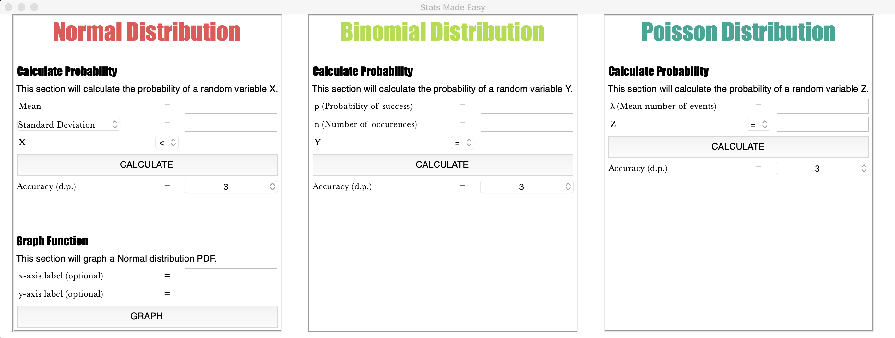
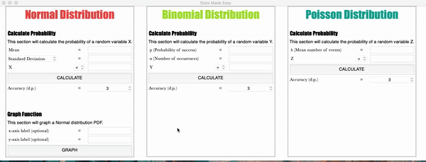
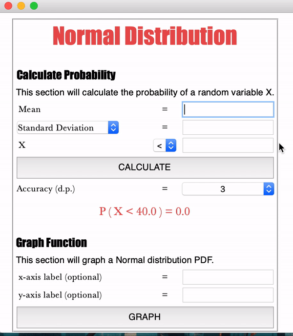
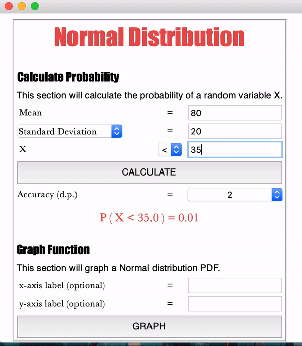
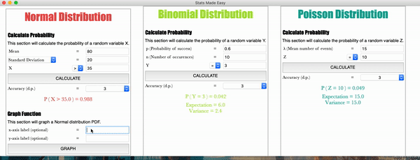
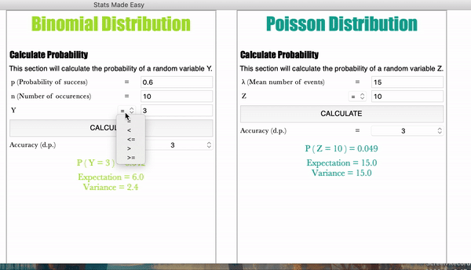

# Stats Made Easy

Simple program to calculate probability of certain events that are modelled using the following name distributions:
* Binomial
* Normal
* Poisson

Also features a function that graphs a normal probability density function with a colored area based on user input.
The named distributions are matched to help A-Level Mathematics Students.

# Features
## Calculate the probability of the random variables
Done by implementing scipy.stats

## Change the precision of the probability output

## Calculate the probability of a random variable being greater than a constant (Normal Distribution)

## Graph the Normal probability density function with a colored area under the graph. This colored area will change depending on whether user chooses > or <.
Done by implementing scipy.stats, numpy, and matplotlib

## For the discrete distributions (binomial and Poisson), users are able to calculate the cumulative probabilities. 
It is also worth noting that the expectation and variance of these discrete distributions will also be printed.

